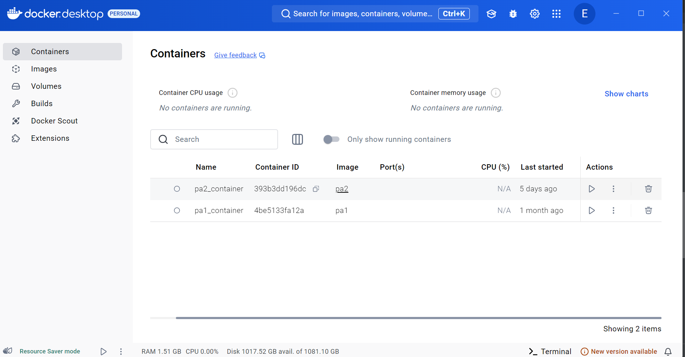
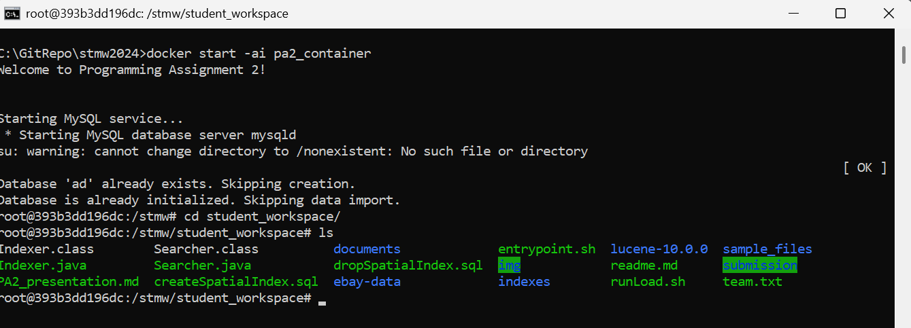
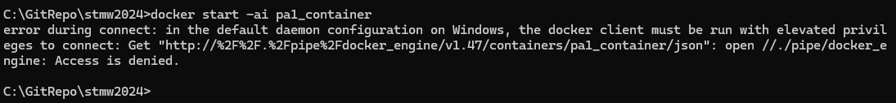
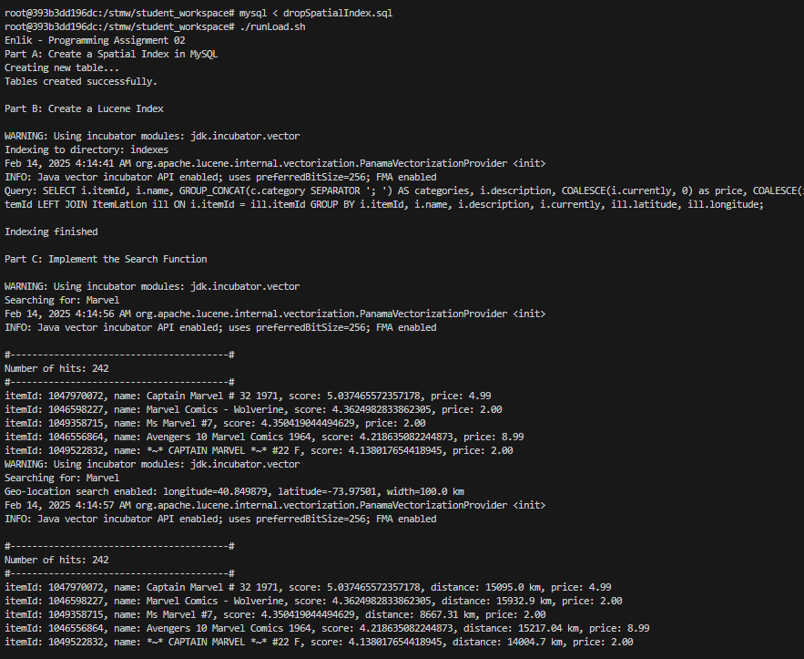
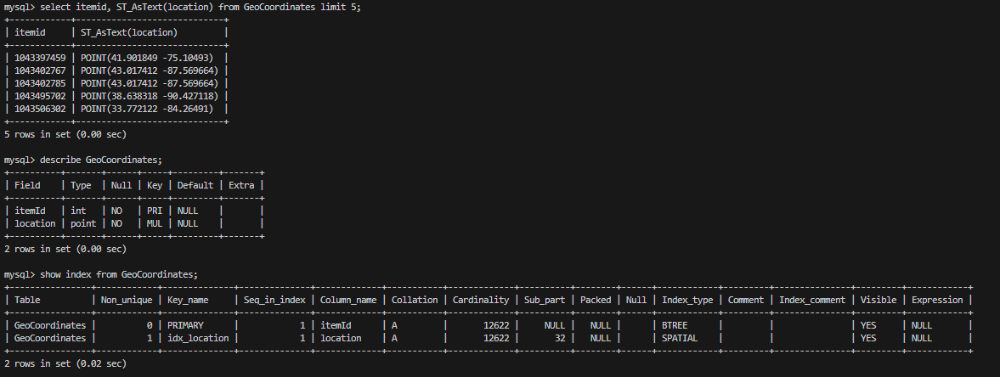
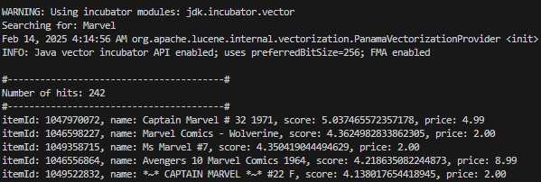
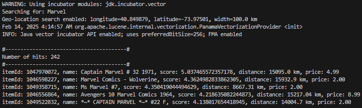

# Search Technology for Media and Web (WiSe 2024/2025) - Programming Assignment 02

Name:
Enlik Enlik

Date:
19 February 2025

Presentation Guidelines:
Duration: 7 minutes for the presentation, followed by a 3-minute discussion.
Content: Focus on what you did and why, outlining how you approached solving the assignment.


## Setting Up PA2 Docker Container in Windows 11

- Start `Docker Desktop` with administrator privilege
  

- Open docker container with this command
  `docker start -ai pa2_container`

- Go to directory where the batch file stored

  `cd student_workspace`

  

- Voila, setup is done for both docker pa2_container

**Error found during setting up:**

- Can't run docker without administrator privilege


## Main Process using Shell Script

- Run the shell script using this command:

   `./runLoad.sh`

   

   This shell script contains the list of bash commands with following step-by-step process:

   1. Create new table and a spatial index via `createSpatialIndex.sql`
      ```sql
      CREATE TABLE IF NOT EXISTS GeoCoordinates (
          itemId INT NOT NULL,
          location POINT NOT NULL,
          PRIMARY KEY (itemId)
      ) ENGINE=InnoDB;
      
      INSERT INTO GeoCoordinates (itemId, location)
          SELECT itemId, ST_GeomFromText(CONCAT('POINT(', latitude, ' ', longitude, ')'))
          FROM ItemLatLon
      WHERE latitude IS NOT NULL AND longitude IS NOT NULL;
      
      CREATE SPATIAL INDEX idx_location ON GeoCoordinates (location);
      ```

      - MySQL Validation
        

        

   2. Create a Lucene index using `Indexer.java`, and put this SQL Query inside java file

      ```sql 
      SELECT i.itemId, i.name, GROUP_CONCAT(c.category SEPARATOR '; ') AS categories, i.description, COALESCE(i.currently, 0) as price, COALESCE(ill.latitude, 0.00) as latitude, COALESCE(ill.longitude, 0.00) as longitude FROM Items i INNER JOIN Categories c ON i.itemId = c.itemId LEFT JOIN ItemLatLon ill ON i.itemId = ill.itemId GROUP BY i.itemId, i.name, i.description, i.currently, ill.latitude, ill.longitude;
      ```

      Explanation:

      - Getting `itemId`, `name`, `description`, `price` values from table `Items`
      - Getting `category` values from table `Categories`
      - Getting `latitude`, `longitude` values from table `ItemLatLon`
      - Using `COALESCE`, we're replacing NULL value(s) with 0, for normalization of column `price`, `latitude`, `longitude`

      

   3. Implement the Search Function in `Searcher.java`

      - Used {"name", "categories", "description"}` as the fields for text searching process using Lucene `SimpleAnalyzer` and `MultiFieldQueryParser`
      - Added all required output fields
      - Added extra arguments for `latitude`, `longitude`, and `width`
      - Used `haversineDistance` mathematical formula to calculate geo-location distance
      - Implemented ranking system using Java `sort` function

      

   4. Example search:
   
      - Without geo-location data
   
      ```bash
      java --enable-native-access=ALL-UNNAMED --add-modules jdk.incubator.vector Searcher "Marvel" 5
      ```
   
      ​	
      
      - With geo-location data
      
        ```bash
        java --enable-native-access=ALL-UNNAMED --add-modules jdk.incubator.vector Searcher "Marvel" 5 -x 40.84987900 -y -73.97501000 -w 100
        ```
      
   

​			


## Known Issues

- The geo-location distance calculation using `haversineDistance` somehow giving wrong calculation, need to be updated


