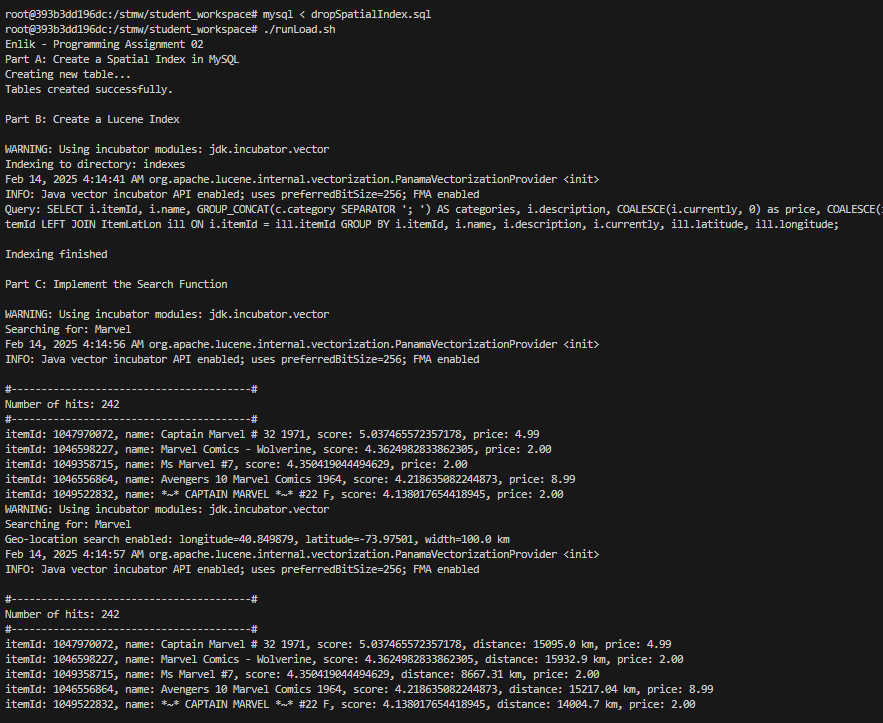

# STMW - Programming Assignment 02


## Part A: Create a Spatial Index in MySQL

MySQL validation


## Part B: Create a Lucene Index

Using this SQL query for storing to Lucene index

```sql
SELECT i.itemId, i.name, GROUP_CONCAT(c.category SEPARATOR '; ') AS categories, i.description, COALESCE(i.currently, 0) as price, COALESCE(ill.latitude, 0.00) as latitude, COALESCE(ill.longitude, 0.00) as longitude FROM Items i INNER JOIN Categories c ON i.itemId = c.itemId LEFT JOIN ItemLatLon ill ON i.itemId = ill.itemId GROUP BY i.itemId, i.name, i.description, i.currently, ill.latitude, ill.longitude;
```

Explanation:

- Getting `itemId`, `name`, `description`, `price` values from table `Items`
- Getting `category` values from table `Categories`
- Getting `latitude`, `longitude` values from table `ItemLatLon`
- Using `COALESCE`, we're replacing NULL value(s) with 0, for normalization of column `price`, `latitude`, `longitude`


## Part C: Implement the Search Function

- Used {"name", "categories", "description"}` as the fields for text searching process using Lucene `SimpleAnalyzer` and `MultiFieldQueryParser`
- Added all required output fields
- Added extra arguments for `latitude`, `longitude`, and `width`
- Used `haversineDistance` mathematical formula to calculate geo-location distance
- Implemented ranking system using Java `sort` function


## Part D: Automize

Implemented via `runLoad.sh`

Example process:




## Known Issues

- The geo-location distance calculation using `haversineDistance` somehow giving wrong calculation, need to be updated