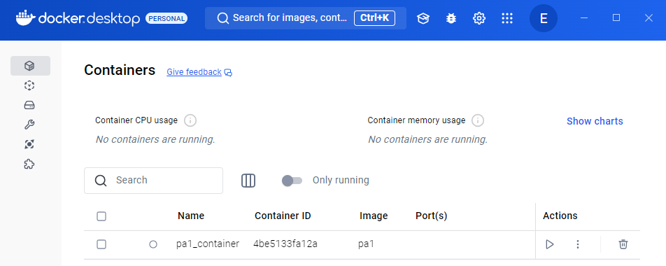
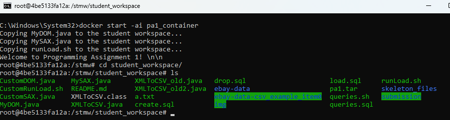
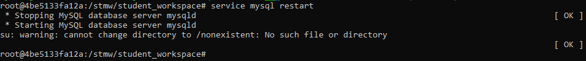
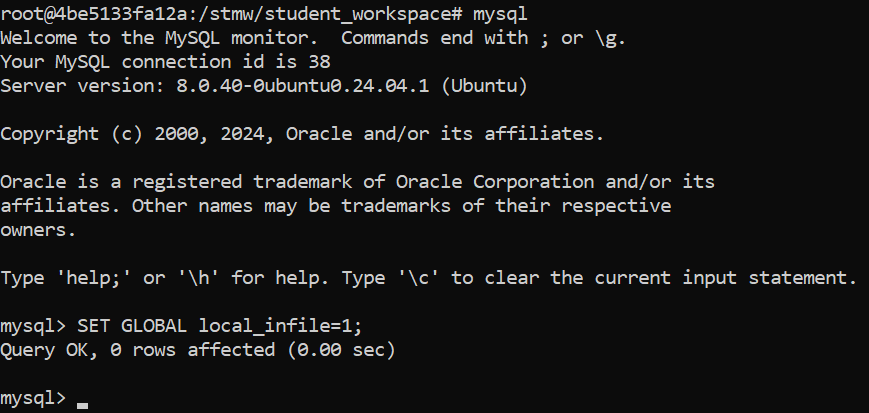
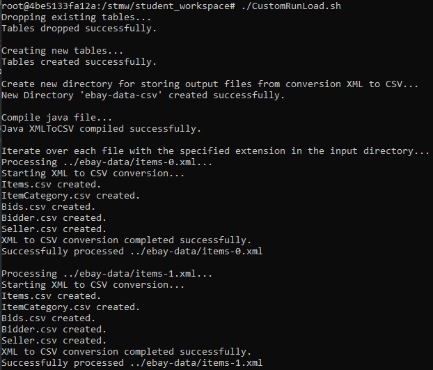
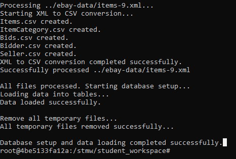
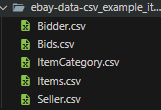

# Search Technology for Media and Web (WiSe 2024/2025) - Programming Assignment 01

Name:
Enlik Enlik

Date:
13 January 2025

Presentation Guidelines:
Duration: 7 minutes for the presentation, followed by a 3-minute discussion.
Content: Focus on what you did and why, outlining how you approached solving the assignment.


## Setting Up PA1 Docker Container in Windows 11

- Start `Docker Desktop` with administrator privilege
  

- Open docker container with this command
  `docker start -ai pa1_container`

- Go to directory where the batch file stored

   `cd student_workspace`

  

- Restart MySQL server inside docker (somehow it's needed to resolve some MySQL server error)
  `service mysql restart`
  

- Setup local-infile inside MySQL
  `mysql`

  `SET GLOBAL local_infile=1;`
  

- Voila, setup is done for both docker and mysql

**Error found during setting up:**

- Can't run docker without administrator privilege


## Main Process using Shell Script

- Run the shell script using this command:

   `./CustomRunLoad.sh`
   
   ...
   
   ...
   

- This shell script contains the list of bash commands with following step-by-step process:

  1. Setup the variable to store path for input and output directory, and file extension extension that needs to be processed (in this case is `XML`)
     ```bash
     INPUT_DIR="../ebay-data" 
     OUTPUT_DIR="ebay-data-csv" 
     EXTENSION="xml"
     ```

  2. Drop existing tables using `drop.sql`
     ```sql
     USE ad;
     DROP TABLE IF EXISTS Bids;
     DROP TABLE IF EXISTS ItemCategory;
     DROP TABLE IF EXISTS Items;
     DROP TABLE IF EXISTS Bidder;
     DROP TABLE IF EXISTS Seller;
     DROP DATABASE IF EXISTS ad;
     ```

  3. Create all required tables using `create.sql` to create new database `ad` and all five required tables

     ```sql
     CREATE DATABASE IF NOT EXISTS ad;
     USE ad;
     
     CREATE TABLE Items (
         ItemID VARCHAR(255) PRIMARY KEY,
         Name TEXT,
         Currently DECIMAL(8, 2),
         Buy_Price DECIMAL(8, 2),
         First_Bid DECIMAL(8, 2),
         Number_of_Bids INT,
         Location TEXT,
         Country TEXT,
         Started DATETIME,
         Ends DATETIME,
         Description VARCHAR(4000)
     );
     
     CREATE TABLE ItemCategory (
         ItemID VARCHAR(255),
         Category VARCHAR(255),
         PRIMARY KEY (ItemID, Category),
         FOREIGN KEY (ItemID) REFERENCES Items(ItemID)
     );
     
     CREATE TABLE Bidder (
         UserID VARCHAR(255) PRIMARY KEY,
         Rating INT,
         Location TEXT,
         Country TEXT
     );
     
     CREATE TABLE Bids (
         BidderID VARCHAR(255),
         Time DATETIME,
         Amount DECIMAL(8, 2),
         PRIMARY KEY (BidderID, Time),
         FOREIGN KEY (BidderID) REFERENCES Bidder(UserID)
     );
     
     CREATE TABLE Seller (
         UserID VARCHAR(255) PRIMARY KEY,
         Rating INT
     );
     ```

  4. Create new directory using shell script
     ```bash
     mkdir -p "$OUTPUT_DIR"
     ```

  5. Compiling Java file for the purpose of converting all XML input files to CSV output files
     ```bash
     javac XMLToCSV.java
     ```

  6. Using `For-Loop` shell command, we're running compiled Java program `XMLToCSV` to convert all XML input files into CSV output

     - This Java program using DOM parsing with delimiter `\t` and end-of-line character `\n`

     - Using arguments from shell script, we can read every XML input files and append the result to CSV output files
       ```java
       FileWriter fw = new FileWriter(file, true);
       ```

     - Using our designed relational schema, we implemented it into Java code, for example in table `Items`
       ```java
       for (int i = 0; i < nodeList.getLength(); i++) {
                   Element element = (Element) nodeList.item(i);
                   String itemID = element.getAttribute("ItemID");
                   String name = getTagValue("Name", element);
                   String currently = getTagValue("Currently", element);
                   String buyPrice = getTagValue("Buy_Price", element);
                   String firstBid = getTagValue("First_Bid", element);
                   String numberOfBids = getTagValue("Number_of_Bids", element);
                   String location = getTagValue("Location", element);
                   String country = getTagValue("Country", element);
                   String started = getTagValue("Started", element);
                   String ends = getTagValue("Ends", element);
                   String description = getTagValue("Description", element);
                   
                   bw.write(String.format("%s\t%s\t%s\t%s\t%s\t%s\t%s\t%s\t%s\t%s\t%s\n",
                           itemID, name, currently, buyPrice, firstBid, numberOfBids, location, 					country, started, ends, description));
       }
       ```

  7. After all files are successfully processed, we will get all CSV output files in the output folder, looks like this
     

  8. Using `load.sql`, we inserted all of these CSV files into MySQL database `ad` inside docker container. We're also specifying the delimiter and end-of-line character.

     ```sql
     USE ad;
     
     LOAD DATA LOCAL INFILE 'ebay-data-csv/Items.csv' 
     INTO TABLE Items 
     FIELDS TERMINATED BY '\t' 
     LINES TERMINATED BY '\n'
     IGNORE 1 LINES;
     ```

     - Don't forget to add parameter `--local-infile=1` in the mysql command, looks like this:
       ```bas
       mysql --local-infile=1 ad < load.sql
       ```

  9. Removing all temporary files in the CSV output folder, so we can save the memory storages, as we're already stored all the CSV values into MySQL database.

  10. Finally, we can checking all stored values in MySQL database with normal SQL query like this:
      ```sql
      -- 1. Find the number of users in the database.
      select count(*) as totalUsers from Bidder;
      
      -- 2. Find the number of items in ”New York”, i.e., items whose location is exactly the string
      -- ”New York”. Pay special attention to case sensitivity, i.e. you should e.g. not match items in ”new york”.
      select count(*) as totalItemsInNewYork from Items where Location = "New York";
      
      -- 3. Find the number of auctions belonging to exactly four categories. Be careful to remove
      -- duplicates, if you store them.
      select count(*) as totalItemWithFourCategories from (
          select itemID, count(*) as numOfCategory from ItemCategory group by ItemID
      ) SQ where SQ.numOfCategory = 4;
      
      -- 4. Find the ID(s) of current (unsold) auction(s) with the highest bid. Remember that
      -- the data was captured at December 20th, 2001, one second after midnight. Pay special
      -- attention to the current auctions without any bid.
      
      -- 5. Find the number of sellers whose rating is higher than 1000.
      select count(*) as NumOfSellersWithRatingHigherThan1K from Seller where rating > 1000;
      
      -- 6. Find the number of users who are both sellers and bidders.
      select count(*) as NumOfUsersWhoAreSellerAndBidder from Bidder a, Seller b where a.userID = b.userID;
      
      -- 7. Find the number of categories that include at least one item with a bid of more than $100.
      select count(*) as NumOfUsersWhoAreSellerAndBidder from ItemCategory a, Seller b where a.userID = b.userID;
      ```

      - Example output from SQL queries: run `queries.sh`
        ```bash
        root@4be5133fa12a:/stmw/student_workspace# ./queries.sh
        totalUsers
        7010
        totalItemsInNewYork
        144
        totalItemWithFourCategories
        8365
        NumOfSellersWithRatingHigherThan1K
        3130
        NumOfUsersWhoAreSellerAndBidder
        6717
        ERROR 1054 (42S22) at line 25: Unknown column 'a.userID' in 'where clause'
        ```

        

## Known Limitations

- There is an error in `Bids` table as I missed `itemID` column

