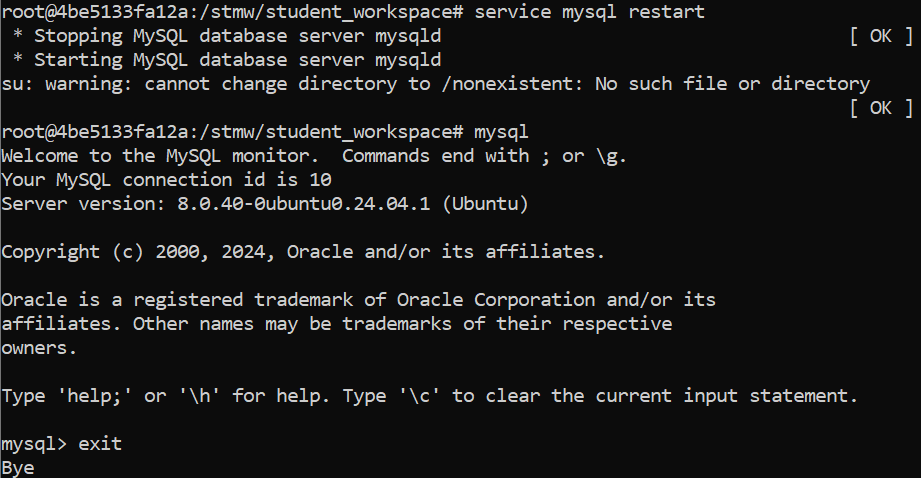

# stmw2024
Study repository for Uni Bremen course "Search Technology for Media &amp; Web (Winter Semester 2024/2025)"


## Design Relational Schema

### Step 1: List Your Relations
**Items**:
- `ItemID` (Primary Key)
- `Name`
- `Currently`
- `Buy_Price`
- `First_Bid`
- `Number_of_Bids`
- `Location`
- `Country`
- `Started`
- `Ends`
- `Description`

**ItemCategory**:
- `ItemID` (Foreign Key)
- `Category` (Composite Primary Key with `ItemID`)

**Bids**:
- `ItemID` (Foreign Key)
- `BidderID` (Composite Primary Key with `ItemID` and `Time`)
- `Time`
- `Amount`

**Bidder**:
- `UserID` (Primary Key)
- `Rating`
- `Location`
- `Country`

**Seller**:
- `UserID` (Primary Key)
- `Rating`


### Step 2: List Functional Dependencies

Let's list the non-trivial functional dependencies for each relation:

- **Items**:
  - `ItemID → Name, Currently, Buy_Price, First_Bid, Number_of_Bids, Location, Country, Started, Ends, Description`
  
- **ItemCategory**:
  - `ItemID, Category → (Item is identified by the combination of ItemID and Category)`

- **Bids**:
  - `ItemID, BidderID, Time → Amount`
  
- **Bidder**:
  - `UserID → Rating, Location, Country`
  
- **Seller**:
  - `UserID → Rating`
  

These dependencies capture the relationships and constraints in your data.

### Step 3: Boyce-Codd Normal Form (BCNF)
Checking if the relations are in BCNF:

- **Items**: Already in BCNF, as all non-trivial FDs have a superkey as their determinant.
- **ItemCategory**: In BCNF, as the combination of ItemID and Category forms a composite key.
- **Bids**: In BCNF, as all non-trivial FDs have a superkey as their determinant.
- **Bidder**: In BCNF, as all non-trivial FDs have a superkey as their determinant.
- **Seller**: In BCNF, as all non-trivial FDs have a superkey as their determinant.

### Step 4: Fourth Normal Form (4NF)
There are no multi-valued dependencies for all five columns

### Key components

1. **Items** table:
    - Contains all essential attributes of an item.
    - `ItemID` as the primary key.

2. **ItemCategory** table:
    - Handles the relationship between items and categories.
    - Composite primary key consisting of `ItemID` and `Category`.

3. **Bids** table:
    - Records bid information.
    - Composite primary key of `ItemID`, `BidderID`, and `Time`.

4. **Bidder** table:
    - Details about each bidder.
    - `UserID` as the primary key.

5. **Seller** table:
    - Details about each seller.
    - `UserID` as the primary key.


## References

- How to use `dos2unix` in Windows
  https://unix.stackexchange.com/questions/721844/linux-bash-shell-script-error-cannot-execute-required-file-not-found

  - Convert using this command:
    ```shell
    dos2unix ./<shell_file_name>.sh
    ```

  - Example usage:
    

- Got this error
  `ERROR 2002 (HY000): Can't connect to local MySQL server through socket '/var/run/mysqld/mysqld.sock' (2)`

  - Restart `mysql` inside docker container:
    `service mysql restart` and try to run `mysql` again
  - Example:
    
  - Source: https://forum.hestiacp.com/t/error-2002-hy000-cant-connect-to-local-mysql-server-through-socket-run-mysqld-mysqld-sock-2/10239

